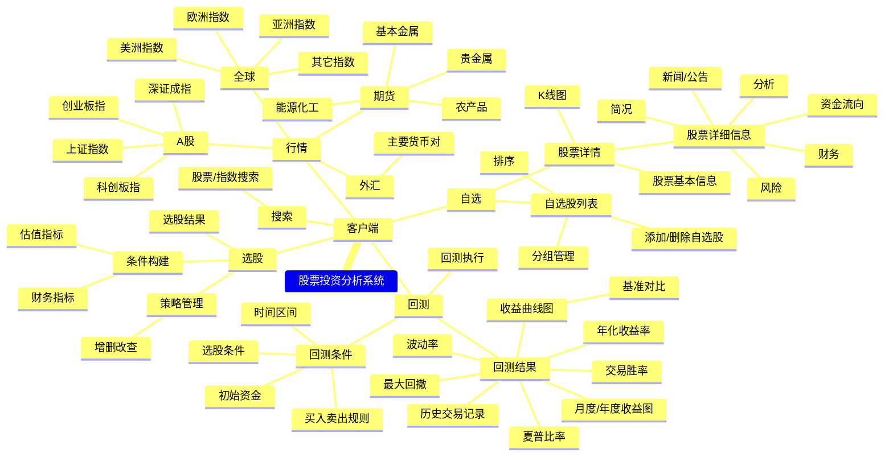

# 思维导图

```mermaid
---
config:
  layout: tidy-tree
---
mindmap
    股票投资分析系统
        客户端
            搜索
                股票/指数搜索
            行情
                全球
                    美洲指数
                    欧洲指数
                    亚洲指数
                    其它指数
                A股
                    上证指数
                    深证成指
                    创业板指
                    科创板指
                期货
                    贵金属
                    能源化工
                    基本金属
                    农产品
                外汇
                    主要货币对
            自选
                自选股列表
                    添加/删除自选股
                    分组管理
                    排序
                股票详情
                    股票基本信息
                    K线图
                    股票详细信息
                        新闻/公告
                        资金流向
                        简况
                        财务
                        分析
                        风险
            选股
                条件构建
                    财务指标
                    估值指标
                策略管理
                    增删改查
                选股结果
            回测
                回测条件
                    时间区间
                    初始资金
                    选股条件
                    买入卖出规则
                回测执行
                回测结果
                    收益曲线图
                        基准对比
                    月度/年度收益图
                    年化收益率
                    最大回撤
                    波动率
                    夏普比率
                    交易胜率
                    历史交易记录

```
